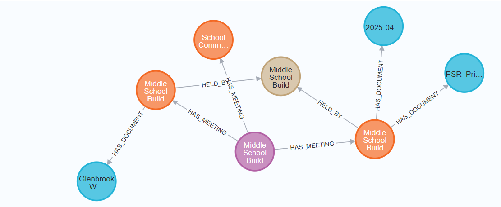

# Submission Notes

**Candidate Name:** Gal Malach
-
**Date:** 17/01/2026
-
**Time Spent:** ~5 hours
---

## Graph Schema Design

### Entity Types

The following entity types were extracted from the Pollard Middle School Building Project webpage using an LLM-based extraction process:

| Entity Type | Description | Example Properties |
|------------|-------------|-------------------|
| Project | Represents the overall construction project | name, url, description |
| Meeting | Represents a specific project-related meeting | title, date, type |
| Committee | Represents a formal committee or board that held a meeting | name, hasVotingPower |
| Topic | Represents a meaningful discussion topic raised during a meeting | name, category |
| Document | Represents documents associated with a meeting (extracted but not persisted) | title, type, url |
| Statement | Represents notable remarks or conclusions from a meeting (extracted but not persisted) | text, speaker |

---

### Relationships

| Relationship | From → To | Description |
|-------------|----------|-------------|
| HAS_MEETING | Project → Meeting | Connects a project to its related meetings |
| HELD_BY | Meeting → Committee | Indicates which committee conducted the meeting |
| DISCUSSED | Meeting → Topic | Represents topics discussed during the meeting |
| HAS_DOCUMENT | Meeting → Document | Links meetings to their related documents (extracted only) |
| HAS_STATEMENT | Meeting → Statement | Links meetings to notable statements (extracted only) |

---

### Design Decisions

- The graph schema was designed based on an analysis of the target webpage, which primarily consists of a construction project described through a series of formal meetings and related discussion topics.
- Project and Meeting entities were chosen as the core nodes because meetings are the main mechanism through which information, decisions, and progress are communicated on the page.
- Committees were modeled as separate entities to capture the organizational bodies responsible for holding meetings and making decisions.
- Topics were modeled as first-class entities to represent meaningful discussion points and enable future analysis across multiple meetings.
- Relationships were selected to reflect the natural structure of the content: projects contain meetings, meetings are held by committees, and meetings discuss topics.
- The schema intentionally avoids over-fragmentation to keep the knowledge graph readable and focused on high-level structure.


## Technical Approach

### Tech Stack

- **Backend:** Python
- **Web UI:** Lightweight HTML form
- **LLM:** Ollama (llama3.2 model)
- **Database:** Neo4j
- **Infrastructure:** Docker & Docker Compose
- **Additional Libraries:** fastapi, uvicorn, requests, beautifulsoup4, neo4j


### LLM Prompt Strategy

A single structured prompt is used to extract entities and relationships from cleaned webpage text.

The prompt instructs the LLM to:
- Identify projects, meetings, and documents
- Return structured JSON
- Preserve relationships between entities


### Challenges & Solutions

1. **Challenge:** Noisy HTML content  
   - **Solution:** Extracted only meaningful text before sending it to the LLM.

2. **Challenge:** First-time use of Docker and Neo4j  
   - **Solution:** This was my first experience working with Docker and Neo4j, which required learning new concepts such as containers. I addressed this by reading official documentation, experimenting with the provided Docker setup, using LLM tools (e.g., ChatGPT) for guidance, and watching technical tutorials. This process helped me understand the system architecture and successfully integrate all components into a working end-to-end pipeline.

3. **Challenge:** Large input size causing unstable LLM output and long inference time  
   - **Solution:** The extracted webpage text was truncated to a fixed maximum length before being sent to the LLM. This reduced token count, improved response stability, and minimized cases of invalid JSON returned by the model.


---

## Running the Application

### Prerequisites

- Docker Desktop installed and running
- Ports 11434, 7474, 7687 available

### Installation & Running the Application

#### Docker
 Make sure you are located in the project root directory before running any of the commands below.

Start the infrastructure services (Neo4j and Ollama) using Docker:

```bash
./start.sh        # macOS / Linux
.\start.ps1       # Windows
```

Wait until the setup process completes successfully and all services are running.

#### Server
Start the backend server (FastAPI). From the project root directory, create and activate a Python virtual environment, install the required dependencies, and run the server:

```bash
python -m venv venv
.\venv\Scripts\Activate.ps1
pip install -r requirements.txt
python -m uvicorn app:app --reload

```
After running the commands above, the backend server will be available at:
http://localhost:8000

#### Client

To run the client side, simply open the index.html file in a web browser.


### Using the Application

After the client interface is loaded, follow the steps below:

1. Enter a webpage URL into the input field.
2. Click the **Build Graph** button.
3. Wait for the process to complete. The application will:
   - Scrape the webpage content
   - Extract entities and relationships using the LLM
   - Write the resulting knowledge graph to Neo4j
4. Once the process finishes successfully, a link to Neo4j Browser will be displayed.
5. Click the link to open Neo4j Browser.
6. In Neo4j Browser, run the following Cypher query to view the generated graph:

```cypher
MATCH (n)-[r]->(m)
RETURN n, r, m
```


### Screenshots – Generated Knowledge Graphs

The following screenshots show the knowledge graphs generated from the provided test webpages.

### Test Website 1


### Test Website 2


### Test Website 3



## What I Would Improve

If I had more time, I would:

1. Perform deeper analysis of the source webpages and their content, which could reveal additional important entities and relationships that may have been missed due to the limited time scope of the assignment.
2. Add client-side progress indication for long LLM inference.
3. Improve entity deduplication across multiple webpages.


## Questions / Feedback

The assignment was clear and well-structured.  
No additional questions at this time.
